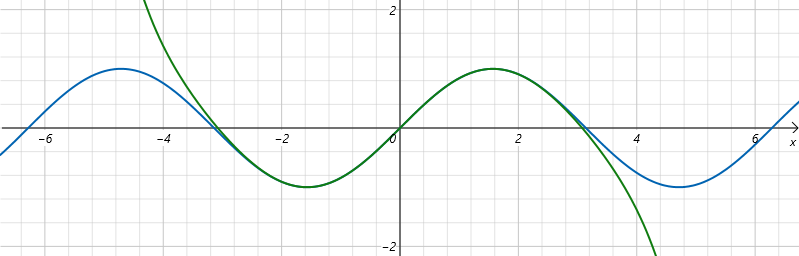

## 巴塞尔问题

*2022-09-30*

### 问题的出现

巴塞尔问题是意大利数学家 Pietro Mengoli 在 1644 年首次提出，描述为求所有非 0 自然数平方的倒数和，即：

问题被提出后经过 90 年，最早被欧拉在 1734 年解决，而令人意外的是关于整数的无穷项求和竟然和 *π* 这个无理数联系了起来。因欧拉的故乡在瑞士巴塞尔，该问题也被命名为巴塞尔问题。巴塞尔问题难倒过包括同时代的 Jacob Bernoulli、Johann Bernoulli、Leibniz 在内的很多数学家，而欧拉解决这个问题时，只有 28 岁，也是欧拉的成名作。

### 热身

利用高等数学里数列极限的确界定理，单调递增有上界，则极限存在。首先这个数列明显单调递增，即有 *S(n+1) > S(n)*，再计算出任意一个上界出来即可。

当 n 趋于无穷大时，存在一个上界 2，也即这个无穷数列的极限存在。

### 欧拉的证明方法

考虑将正弦函数转换为如下多项式形式，并通过一定的方法得到所有系数 *a / b / c / d / e...* 的值。

首先将 *x = 0* 代入等式，得到 *a=0*。两边对 *x* 求一次导数后带入 *x = 0*，得到 *b = 1*。

以此类推，得到 *c = 0, d = -1/3!, e = 0...*，最终得出如下形式。

其实这就是正弦函数按照泰勒公式展开后在 *x=0* 处的形式，即正弦函数的 Maclaurin 展开式。将展开式的前四项函数图像（绿色）和正弦函数图像（蓝色）对比如下，当展开项越多，就和正弦函数越接近，当展开项趋于无穷大，两者等价，函数图像完全重合。

再从另一个角度，既然正弦函数可以展开成多项式的形式，且 *±nπ* 是正弦函数的零点，那么以这些零点作为基础构造一个新的多项式。先考虑 *-π / 0 / π* 这三个零点，可以写出如下三次的多项式。

注意第三项不是 *(x - π)* 的原因是 *x* 在 *(-π, 0)* 区间正弦值是小于 0。然后在 *x = 0* 处求导并带入后得到 *c* 的值。

将 *c* 带入得到。

可以看到在 *-π / 0 / π* 三个值带入确实是函数的零点。以此类推考虑 *-2π* 和 *2π* 作为零点递推出下一个多项式。

以此类推，最终将正弦函数展开成如下多项式的形式。

同样的将新的多项式函数，取前面 5 项因式组成的函数图像（红色）同时对比结果如下，当展开成无穷多项时，最终也就和正弦函数图像完全重合。

到此为止，将正弦函数转换成了两种不同的多项式形式。那么两个多项式里 *x* 相同次数的项的系数也应该对应相等。于是将第二个多项式展开。

重点关注 *x* 的三次方项的系数，当第二个多项式完全展开后，是一个无穷多项的数列，且和正弦函数的 Maclaurin 展开式的三次方系数相同，即有：

整理两边去掉负号再乘以 *π* 的平方后得到

到这里证明就结束了，而整个证明过程最大的疑惑就是，明明是计算整数的平方相关结果，但最终和 *π* 联系在了一起，不得不感叹数学的神奇和美妙。

### 其他证明方法

有人在网络上整理了巴塞尔问题的二十多种证明方法，从微积分、复函数、泰勒公式、傅里叶公式等角度得到了证明方法，参考阅读[链接（学渣劝退）](https://www.cnblogs.com/misaka01034/p/BaselProof.html)。

### 参考链接
[1. 欧拉成名作！证明全体自然数平方的倒数和=π^2/6](https://www.bilibili.com/video/BV1cb411r7ac/?vd_source=9454d2431b3d9551fbf15ca6dda64986)  